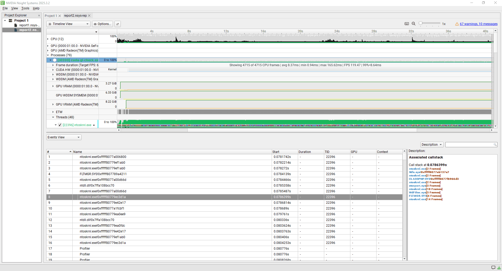
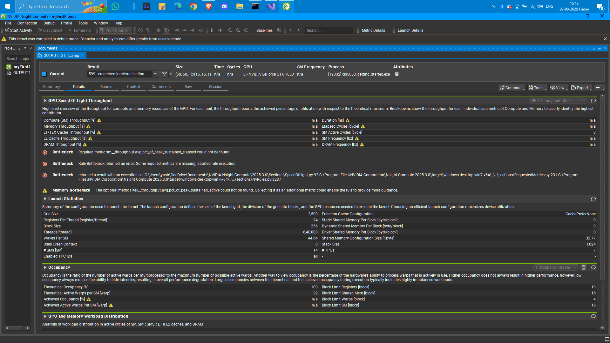
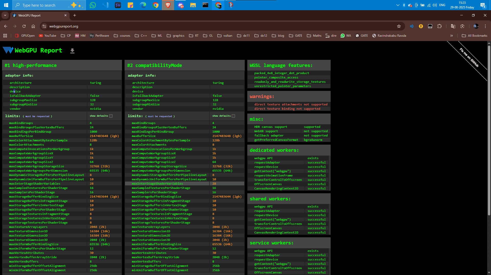

Project 0 Getting Started
====================

**University of Pennsylvania, CIS 5650: GPU Programming and Architecture, Project 0**

* Yash Gosavi 
  * [LinkedIn]()
  * [personal website]()
  * [twitter]()
* Tested on: Windows 11, AMD Ryzen-5 5600H @ 3.30 GHz 16GB, GTX 1650 4GB (Personal laptop)

## 1. CUDA-GL Check 

I did the setup of the GPU developement tools and verified that my machine can build, run and do performance analysis.
Below is the output of the project and the SM is displayed in the title bar of the window. 

CUDA OpenGL interop

### 1.1 Nsight Suite
NVidia provide a suite of tools to the GPU developers in order to program and debug on Nvidia GPUs. In this assignment I downloaded and setup the below tools.

#### 1.1.1 Nsight Visual Studio Integration
I used NVidia Visual Studio Integration to debug my program and visualize the threads and the warps. I was able to set conditional breakpoints and set through the program.

Nsight Visual Studio Integration

#### 1.1.2 Nsight Systems
Nsight System allowed to do system wide profiling and performance analysis.   

Nsight Systems

#### 1.1.3 Nsight Compute 

I faced problems with working with Nsight Compute. Turns out that profiling OpengGL-Cuda interop programs is not possible on windows because it trigger TDR which is necessary to avoid hangs, so windows abruptly closes the application. The work around that I found after going through the specs was to use `--replay-mode application`. I was able to generate a report of detailed performance metrics

Nsight Compute Report Details

Nsight Compute Report Summary

### 1.2 WebGL and WebGPU Support Check
Below are the WebGPU and WebGL reports from Chrome browser on my local machine where it states that it supports my Nvidia graphics card. 

WebGL Report

WebGPU Report

## 2. CUDA Introduction

In this assignment I was able to test my understanding of CUDA indexing as well as threads and blocks. Below are the output of the programs. 

SAXPY

Matrix Transpose

Matrix Multiplication
